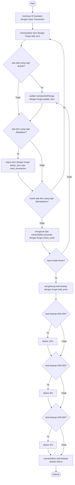

# Super Cashier

## Latar Belakang
Super Cashier adalah sistem kasir self-service untuk sebuah supermarket. Pelanggan bisa langsung memasukkan item, jumlah item, dan harga item yang dibeli.
Modul dibuat dengan menerapkan Object Oriented Programming, function, try-except, documentation, dan clean code.

## Objektif
Alur belanja:
1. Customer membuat ID transaksi customer
2. Customer memasukkan nama item, jumlah item, dan harga item yang dibeli
3. Jika ternyata ada kesalahan dalam memasukkan nama item, jumlah item, atau harga item, customer bisa melakukan update item:
   a. update nama item
   b. update jumlah item
   c. update harga item
4. Jika batal membeli suatu item, customer bisa melakukan hapus item:
   a. hapus 1 item
   b. reset seluruh transaksi
5. Jika sudah selesai berbelanja, tetapi masih ragu apakah harga barang dan nama yang diinput sudah benar, customer bisa melakukan check order dengan output sebagai berikut:
   a. Mengeluarkan pesan "Pemesanan sudah benar" jika tidak ada kesalahan input.
   b. Mengeluarkan pesan "Terdapat kesalahan input data" jika terjadi kesalahan input.
   c. Menampilkan tabel berisi seluruh data pesanan.
6. Terakhir, customer bisa menampilkan total belanja yang harus dibayar dan diskon yang didapatkan (jika ada).

## Alur Code / Flowchart

## Penjelasan dari Function

## Demonstrasi

## Kesimpulan
Contoh tampilan daftar belanja dan total yang harus dibayar:

| Nama Item   |   Jumlah Item |   Harga/Item |   Total Harga |
|-------------|---------------|--------------|---------------|
| Chitato     |            10 |         6000 |         60000 |
| Roti Tawar  |            10 |        11000 |        110000 |
| Teh Botol   |            10 |         3500 |         35000 |

Pemesanan sudah benar.

Anda mendapatkan diskon 5% sebesar Rp 10250. Total belanja Anda adalah Rp 194750 (sudah termasuk diskon).
