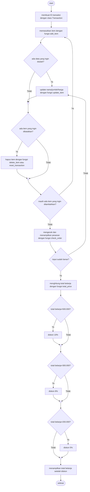

# Super Cashier

## Latar Belakang
Super Cashier adalah sistem kasir self-service untuk sebuah supermarket. Pelanggan bisa langsung memasukkan item, jumlah item, dan harga item yang dibeli.\
Modul dibuat dengan menerapkan Object Oriented Programming, function, try-except, documentation, dan clean code.

## Objektif
Membuat sistem kasir self-service dengan alur belanja berikut:
1. Customer membuat ID transaksi customer
2. Customer memasukkan nama item, jumlah item, dan harga item yang dibeli
3. Jika ternyata ada kesalahan dalam memasukkan nama item, jumlah item, atau harga item, customer bisa melakukan update item:\
   a. update nama item\
   b. update jumlah item\
   c. update harga item
4. Jika batal membeli suatu item, customer bisa melakukan hapus item:\
   a. hapus 1 item\
   b. reset seluruh transaksi
5. Jika sudah selesai berbelanja, tetapi masih ragu apakah harga barang dan nama yang diinput sudah benar, customer bisa melakukan check order dengan output sebagai berikut:\
   a. Mengeluarkan pesan "Pemesanan sudah benar" jika tidak ada kesalahan input.\
   b. Mengeluarkan pesan "Terdapat kesalahan input data" jika terjadi kesalahan input.\
   c. Menampilkan tabel berisi seluruh data pesanan.
6. Terakhir, customer bisa menampilkan total belanja yang harus dibayar dan diskon yang didapatkan (jika ada).

## Alur Code / Flowchart

## Penjelasan dari Function
1. __init()__\
Fungsi inisialisasi untuk class Transaction\
dict_txn (dict) = dictionary untuk menyimpan data transaksi (dict)\
txn_valid (boolean) = untuk menandai apakah data yang diinput ke dalam dictionary transaksi sudah valid. Nilai awal adalah True dan bisa berubah False setelah dicek validitasnya lewat fungsi.

2. add_item(nama, jumlah, harga)\
Fungsi untuk menambahkan item ke dalam dictionary transaksi.\
nama (String, key) = nama item yang dibeli, key dalam dictionary\
jumlah (int) = jumlah item yang dibeli\
harga (int) = harga per item

3. update_item_name(nama, nama_baru)\
Fungsi untuk mengubah nama item dalam dictionary yang sudah diinput.\
nama (String) = nama item sebelum diganti, key dari dictionary\
nama_baru (String) = nama baru untuk item, menjadi key baru dari dictionary

4. update_item_qty(nama, jumlah_baru)\
Fungsi untuk mengubah jumlah item dalam dictionary yang sudah diinput.\
nama (String) = nama item yang ingin diubah jumlahnya, key dari dictionary\
jumlah_baru (int) = jumlah baru dari nama item yang dibeli

5. update_item_price(nama, harga_baru)\
Fungsi untuk mengubah harga item dalam dictionary yang sudah diinput.\
nama (String) = nama item yang ingin diubah jumlahnya, key dari dictionary\
harga_baru (int) = harga baru dari nama item yang dibeli

6. delete_item(nama)\
Fungsi untuk menghapus data nama item beserta jumlah dan harganya dari dictionary.\
nama (String) = nama item yang ingin dihapus

7. reset_transaction()\
Fungsi untuk menghapus semua data pesanan dalam dictionary.

8. print_order()\
Fungsi untuk menampilkan semua pesanan dalam dictionary.

9. check_order()\
Fungsi untuk mengecek validitas dan menampilkan semua pesanan dalam dictionary.

10. total_price()\
Fungsi untuk menampilkan semua pesanan dan total belanja.

## Demonstrasi
1. Menambahkan Item\
input:\
transaksi = c.Transaction()\
transaksi.add_item("Ayam Goreng", 2, 20_000)\
transaksi.add_item("Pasta Gigi", 3, 15_000)\
\
output:\
Menambahkan ke dalam pesanan: Ayam Goreng sejumlah 2 dengan harga Rp 20000.\
Menambahkan ke dalam pesanan: Pasta Gigi sejumlah 3 dengan harga Rp 15000.

2. Menghapus Item\
input:\
transaksi.delete_item("Pasta Gigi")

output:\
Menghapus pesanan Pasta Gigi.
| Nama Barang   |   Jumlah |   Harga |   Total |
|---------------|----------|---------|---------|
| Ayam Goreng   |        2 |   20000 |   40000 |

3. Mereset Transaksi\
input:\
transaksi.reset_transaction()\
\
output:\
Semua item berhasil dihapus.

4. Menghitung total belanja\
input:\
transaksi.total_price()\
\
output:

| Nama Item   |   Jumlah Item |   Harga/Item |   Total Harga |
|-------------|---------------|--------------|---------------|
| Ayam Goreng |             2 |        20000 |         40000 |
| Pasta Gigi  |             3 |        15000 |         45000 |

Pemesanan sudah benar.\
Total belanja Anda adalah Rp 85000.

5. Mengupdate Nama Item\
input:\
transaksi.update_item_name("Teh Kotak", "Teh Botol")\
\
output:

| Nama Barang   |   Jumlah |   Harga |   Total |
|---------------|----------|---------|---------|
| Chitato       |        5 |    6000 |   30000 |
| Roti Tawar    |       20 |   12000 |  240000 |
| Teh Botol     |       10 |    3500 |   35000 |

Mengubah nama item Teh Kotak menjadi Teh Botol.

6. Mengupdate Jumlah Item\
input:\
transaksi.update_item_qty("Chitato", 7)\
\
output:

| Nama Barang   |   Jumlah |   Harga |   Total |
|---------------|----------|---------|---------|
| Chitato       |        7 |    6000 |   42000 |
| Roti Tawar    |       20 |   12000 |  240000 |
| Teh Botol     |       10 |    3500 |   35000 |

Mengubah jumlah item Chitato menjadi 7.

7. Mengupdate Harga Item\
input:\
transaksi.update_item_price("Roti Tawar", 10_000)\
\
output:\

| Nama Barang   |   Jumlah |   Harga |   Total |
|---------------|----------|---------|---------|
| Chitato       |        7 |    6000 |   42000 |
| Roti Tawar    |       20 |   10000 |  200000 |
| Teh Botol     |       10 |    3500 |   35000 |

Mengubah harga item Roti Tawar menjadi 10000.

8. Menghitung Total Belanja dan Diskon\
input:\
transaksi.total_price()\
\
output:

| Nama Item   |   Jumlah Item |   Harga/Item |   Total Harga |
|-------------|---------------|--------------|---------------|
| Chitato     |             7 |         6000 |         42000 |
| Roti Tawar  |            20 |        10000 |        200000 |
| Teh Botol   |            10 |         3500 |         35000 |

Pemesanan sudah benar.\
Anda mendapatkan diskon 5% sebesar Rp 13850. Total belanja Anda adalah Rp 263150 (sudah termasuk diskon).

9. Penginputan Data Bukan Integer\
input:\
transaksi.add_item("Teh Kotak", "empat puluh", 3_500)\
\
output:\
Jumlah barang harus berupa angka!

10. Terdapat Kesalahan Input Pada Transaksi\
input:\
transaksi.check_order()\
\
output:

| Nama Item   |   Jumlah Item |   Harga/Item |   Total Harga |
|-------------|---------------|--------------|---------------|
| Teh Kotak   |           -40 |         3500 |       -140000 |
| Roti Tawar  |            12 |        10000 |        120000 |
| Chitato     |             3 |         6000 |         18000 |

Terdapat kesalahan input jumlah/harga. Mohon cek ulang pesanan.

## Kesimpulan
Modul cashier sudah dapat dipakai untuk pengembangan aplikasi Super Cashier dan sudah dilengkapi dengan defense yang cukup.
